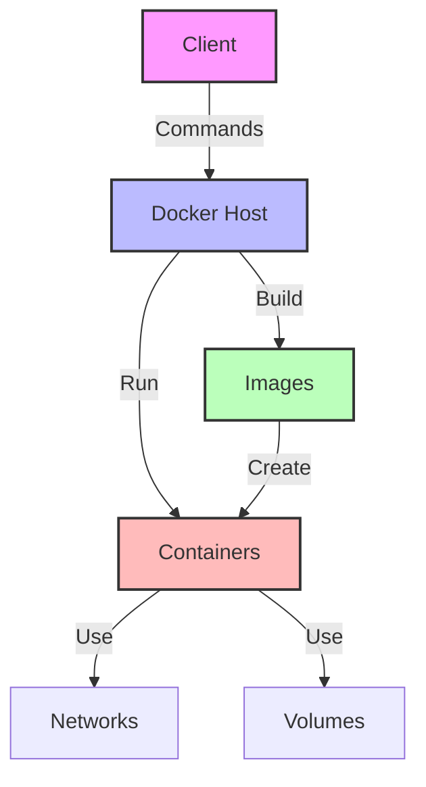
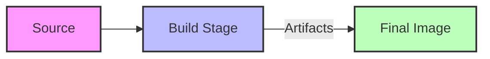
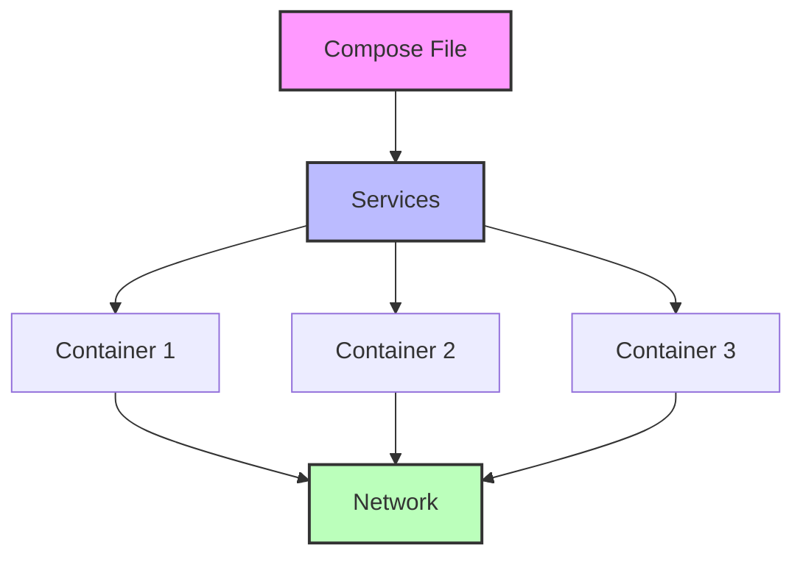

# 🐳 Docker Quick Reference Guide

<div align="center">


[](LICENSE)


*A comprehensive quick reference guide for Docker commands and concepts*


</div>

## 📋 Table of Contents
- [Overview](#-docker-overview)
- [Why Docker?](#-why-docker)
- [Core Concepts](#-core-concepts)
- [Essential Commands](#-essential-commands)
- [Networking](#-networking)
- [Volumes](#-volumes)
- [Multi-stage Builds](#-multi-stage-builds)
- [Docker Compose](#-docker-compose)
- [Best Practices](#-best-practices)
- [Resources](#-resources)

## 🚀 Docker Overview
```ascii
+------------------+     +------------------+
|   Container 1    |     |   Container 2    |
|  +------------+  |     |  +------------+  |
|  |    App     |  |     |  |    App     |  |
|  +------------+  |     |  +------------+  |
+------------------+     +------------------+
         |                        |
         v                        v
+------------------+     +------------------+
|   Docker Engine  |<--->|   Host System    |
+------------------+     +------------------+
```

## 💡 Why Docker?
- 🎯 Run apps consistently anywhere
- 🔒 Keep apps isolated and safe
- 🚀 Easy to move between computers
- 💾 Uses less space than VMs
- 🏗️ Perfect for microservices
- ⚡ Streamlines DevOps workflows

## 🎯 Core Concepts
| Concept | Description |
|---------|-------------|
| **Container** | Like a lightweight virtual machine |
| **Image** | Blueprint for containers |
| **Volume** | External storage for containers |
| **Network** | How containers communicate |
| **Registry** | Where images are stored |
| **Dockerfile** | Instructions to build images |

## 🏗️ Docker Architecture


## ⚡ Essential Commands

### 🔧 Basic Operations
```bash
# Run container
docker run -it --name my-container busybox

# List containers
docker container ls
docker container ls -a

# Stop/Remove container
docker stop container_name
docker rm container_name

# Execute in container
docker exec -it container_name command
```

### 🖼️ Image Operations
```bash
# List images
docker image ls

# Pull image
docker pull image_name

# Remove image
docker rmi image_name

# Build image
docker build -t image_name .
```

## 🌐 Networking
```ascii
+------------------+     +------------------+
|   Container 1    |     |   Container 2    |
|  +------------+  |     |  +------------+  |
|  |    App     |  |     |  |    App     |  |
|  +------------+  |     |  +------------+  |
+--------|---------+     +--------|---------+
         |                        |
         v                        v
+------------------+     +------------------+
|   Bridge Network  |<--->|   Host Network   |
+------------------+     +------------------+
```

```bash
# Create network
docker network create -d bridge my-network

# Run on network
docker run -it --network=my-network --name container1 ubuntu
docker run -it --network=my-network --name container2 busybox

# List networks
docker network ls

# Inspect network
docker network inspect my-network
```

## 💾 Volumes
```ascii
+------------------+     +------------------+
|   Container 1    |     |   Container 2    |
|  +------------+  |     |  +------------+  |
|  |    App     |  |     |  |    App     |  |
|  +------------+  |     |  +------------+  |
+--------|---------+     +--------|---------+
         |                        |
         v                        v
+------------------+     +------------------+
|   Named Volume   |<--->|   Bind Mount     |
+------------------+     +------------------+
```

```bash
# List volumes
docker volume ls

# Create volume
docker volume create my-volume

# Use volumes
docker run -v my-data:/app/data my-image
docker run -v /host/path:/container/path my-image
docker run --tmpfs /app/temp my-image
```

## 🏭 Multi-stage Builds


```dockerfile
# Build stage
FROM node:14 AS builder
WORKDIR /app
COPY package*.json ./
RUN npm install
COPY . .
RUN npm run build

# Production stage
FROM nginx:alpine
COPY --from=builder /app/build /usr/share/nginx/html
```

## 🎯 Docker Compose


```yaml
version: '3'
services:
  web:
    build: .
    ports:
      - "3000:3000"
    environment:
      - NODE_ENV=production
    volumes:
      - ./data:/app/data
```

### 🚀 Compose Commands
```bash
docker compose up        # Start services
docker compose up -d    # Start in background
docker compose down     # Stop services
docker compose logs     # View logs
```

## ⭐ Quick Tips
- 🎯 Use `-it` for interactive mode
- 🚀 Use `-d` for background mode
- 🔌 Use `-p` for port mapping
- 🔑 Use `-e` for environment variables
- 🏷️ Use `--name` to name containers
- 🗑️ Use `--rm` to auto-remove stopped containers
- 🔄 Use `--restart` for auto-restart

## 📋 Best Practices
1. ✅ Use specific version tags
2. ✅ Keep images small
3. ✅ Use .dockerignore
4. ✅ Don't run as root
5. ✅ Use environment variables
6. ✅ Implement health checks
7. ✅ Use Docker Compose for multi-container apps
8. ✅ Regular security updates
9. ✅ Proper logging
10. ✅ Resource limits

## 🎯 Common Use Cases
1. 🛠️ Development environments
2. 🏗️ Microservices
3. 🔄 CI/CD pipelines
4. 🧪 Testing environments
5. 🚀 Production deployments

## 📚 Resources
- [📖 Docker Docs](https://docs.docker.com/)
- [🐳 Docker Hub](https://hub.docker.com/)
- [🎯 Docker Compose](https://docs.docker.com/compose/)
- [🔒 Docker Security](https://docs.docker.com/engine/security/)
- [🌐 Docker Networking](https://docs.docker.com/network/)
- [💾 Docker Volumes](https://docs.docker.com/storage/volumes/)

---

<div align="center">

### 🤝 Contributing
Contributions, issues, and feature requests are welcome! Feel free to check the [issues page](https://github.com/yourusername/docker-notes/issues).

### 📝 License
This project is licensed under the MIT License - see the [LICENSE](LICENSE) file for details.

[](LICENSE)

</div> 
